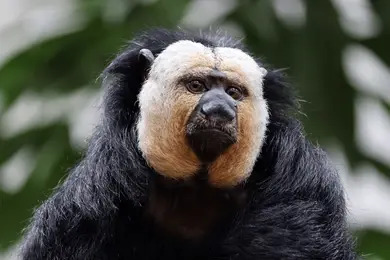

# *Pithecia pithecia*

<!-- Drop this species' photo in this same folder as photo.jpg. Credit the source/license in Overview or here. -->

## Status

| | |
| --- | --- |
| Common name | White-faced Saki |
| Scientific name | *Pithecia pithecia* |
| Clade | New World Monkey |
| Cell Type | Fibroblast |
| Karyotype | 48,XY |
| Sex | Male |
| Status | Complete, not yet public |
| Latest genome version | — |
| Accession ID | [PR00239](../../manifests/sample_data_manifest.csv) |
| NCBI BioSample | |
| S3 Data Location | s3://primate-t2t-genomics-open/species_data/PR00239/ *(not yet public)* |
| Project phase | 1 |

## IUCN Red List

| | |
| --- | --- |
| IUCN status | [Least Concern](https://www.iucnredlist.org/species/43942/192447247) |

## Sequencing details

| Platform | Coverage / Number of reads |
| --- | --- |
| PacBio HiFi | |
| ONT | |
| Hi-C (chromatin capture) | |
| Kinnex RNA | |

## Genome quality

| Metric | Value |
| --- | --- |
| N50 (hap1) | TBD |
| N50 (hap2) | TBD |
| QV (Merqury) | TBD |
| BUSCO complete | TBD |

## Genome Version History

No versions released yet.

Full technical details (file locations, raw data, all versions): see [../../README_dataset.md](../../README_dataset.md).
